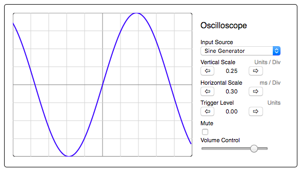

# react-tone-scope

> Visualizing Web Audio Signals in Realtime

## Inspiration and Resources

- [Tone.JS UI elements](https://github.com/Tonejs/ui)

## Authors

- **Jared Ellison** - [jaredellison.net](http://jaredellison.net/)

